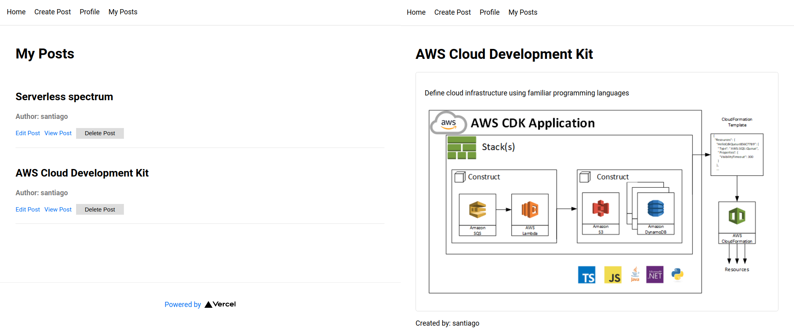

Frontend of this [backend](https://github.com/s4nt14go/workshop-cdk-appsync-next-backend) for [CDK with Next.js and AWS Amplify Workshop](https://github.com/dabit3/next.js-cdk-amplify-workshop)

Screenshots:

<p align="center">
  
</p>

#### Requirements
* AWS CLI
* AWS account
* Serverless Framework

### Installation

* First deploy [backend](https://github.com/s4nt14go/workshop-cdk-appsync-next-backend) and copy the generated `cdk-exports.json` here.  
* Clone this repo and install dependencies with `npm i`
* Run it for local development
```shell script
npm run dev
```
* Deploy it on AWS, first configure your profile:
```shell script
export AWS_DEFAULT_PROFILE==<your aws profile>
export AWS_PROFILE=$AWS_DEFAULT_PROFILE
``` 
...and then deploy with:
```shell script
npx serverless
```
* For cleanup:
```
sls remove
```
